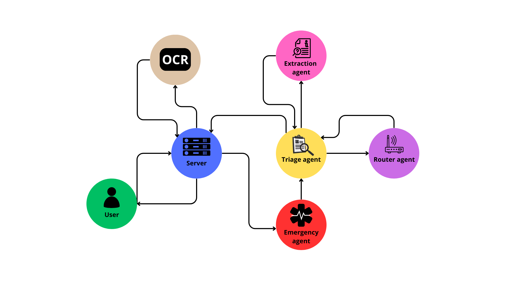

# 🏥 Agente de Triagem com LangGraph

## 🧠 Descrição

Este projeto consiste no desenvolvimento de um sistema de triagem de emergência baseado em uma arquitetura cliente-servidor. O sistema utiliza um agente de IA para interagir com o usuário, analisar o contexto das mensagens e identificar emergências, garantindo que todas as informações necessárias sejam coletadas.

O frontend se comunica com o backend via HTTP. O backend utiliza múltiplos agentes de IA:

- Um agente principal para conduzir a triagem.
- Um agente auxiliar para análise contextual.
- Um agente para gerar um sumário organizado das informações coletadas.

Todas as interações são salvas em um banco de dados MongoDB, permitindo que a IA “lembre” de conversas anteriores.

---

## 📊 Diagrama da Arquitetura



---

## 🎥 Demonstração

Assista ao vídeo explicativo do projeto no YouTube:  
🔗 [https://youtu.be/ukCLS02CvFA](https://youtu.be/ukCLS02CvFA)

---

## 🚀 Funcionalidades

- **Agente de Triagem Inteligente:** Baseado em LangGraph, conduz a triagem analisando mensagens e contextos.
- **Geração de Sumário:** Um agente organiza e resume os dados coletados.
- **Persistência de Dados:** Mensagens são salvas em MongoDB para histórico e continuidade.
- **Reconhecimento Óptico de Caracteres (OCR):** Utiliza EasyOCR para extrair texto de imagens.
- **Testes Automatizados:** Desenvolvidos com Pytest para garantir a confiabilidade do sistema.

---

## 🧰 Tecnologias Utilizadas

- **Backend:** Python (FastAPI, Uvicorn)
- **Frontend:** HTML, CSS, JavaScript
- **Banco de Dados:** MongoDB
- **Agente:** LangGraph
- **OCR:** EasyOCR
- **Testes:** Pytest

---

## 📁 Estrutura do Projeto

```bash
├── app/
│   ├── db/
│   │   ├── database.py
│   │   └── models.py
│   ├── routes/
│   │   └── webhook.py
│   ├── services/
│   │   ├── llm_client.py
│   │   └── triage_agent.py
│   └── utils/
│       └── emergency.py
├── Frontend/
├── teste/
│   ├── test_emergency.py
│   ├── test_llm_client.py
│   └── test_webhook.py
├── venv/
├── .env
├── .gitignore
├── main.py
├── pytest.ini
└── requirements.txt
```

##🧪 Como Rodar o Projeto

Instale as dependências
```bash
pip install -r requirements.txt
```

Ative o ambiente virtual
```bash
source venv/bin/activate
```

Inicie o backend
```bash
uvicorn main:app --reload
```

Inicie o MongoDB via Docker
```bach
docker start clinicai-mongo
```

Abra o Frontend

Navegue até a pasta Frontend/

Abra o arquivo index.html no navegador

🧾 Licença

Este projeto está licenciado sob a MIT License

